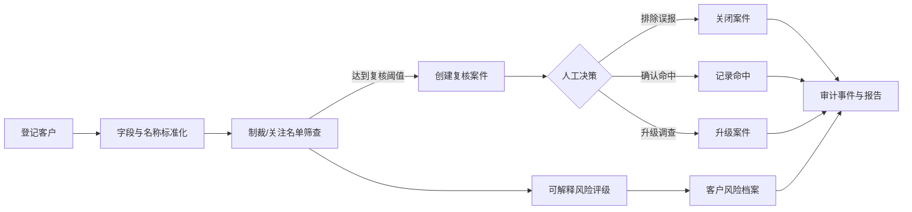

# KYC Compliance Platform

面向香港 KYC/AML 场景的中文合规业务后台。项目把客户登记、名单筛查、风险评级、人工复核、批量报告、质量评估和审计留痕串成一条可运行、可测试、可演示的工作流。

`Python 3.9+` · `FastAPI` · `SQLAlchemy` · `SQLite / PostgreSQL` · `23 tests passed` · `85% coverage` · `v0.3.0`

> 本项目是工程演示与决策支持工具，不构成法律意见，也不会自动作出制裁认定、可疑交易申报或开户决定。生产规则、数据源、阈值、留存政策和人工复核流程必须由适用机构的合规负责人批准并验证。

## 项目亮点

- 中文响应式业务工作台，面向一线业务人员和合规复核人员
- 客户保存后自动执行名称标准化、名单筛查和可解释风险评级
- 命中结果进入人工复核队列，支持排除误报、确认命中和升级调查
- 决策、备注和状态变化写入审计事件，保留可追溯证据
- 支持 CSV、JSONL、Excel、PDF 和运行清单等批处理产物
- 内置版本化黄金评估集，可比较筛查阈值并检查回归质量
- 同时提供 Web 后台、REST API、CLI、Docker Compose 和数据库迁移
- 离线演示固定使用合成数据，不依赖实时外部名单

## 界面预览与业务流程

以下截图由自动化浏览器在隔离数据库中生成，全部为合成演示数据，不包含真实客户信息。

### 1. 今日总览

管理人员可以快速查看客户数量、活动案件、审计事件、待处理事项和案件状态分布，并直接进入高优先级复核。


### 2. 客户台账

业务人员在这里登记、搜索和查看客户。系统展示注册号、注册地、LEI、PEP 标记、风险等级、筛查状态和更新时间。


### 3. 案件人工复核

名单候选不会被系统直接认定为命中。复核人员可以检查匹配分数、名单来源和证据，再选择“排除误报”“确认命中”或“升级调查”，同时记录理由。


### 4. 批次处理与报告

后台可以生成可重复的离线模拟批次，汇总总记录数、筛查复核、潜在命中和重复候选，并下载 Excel、PDF、CSV、JSONL 及审计清单。


### 5. 黄金集质量评估

质量页面使用固定标注集计算 Precision、Recall、F1、实体召回、风险分类准确率和去重指标，也提供阈值扫描与错误案例下载，便于发现模型或规则回归。


### 6. OpenAPI 接口文档

FastAPI 自动生成交互式接口文档，覆盖健康检查、客户、筛查、案件、仪表盘、批次和评估等接口，方便联调与二次开发。


## 核心流程



## 快速开始

### 方式一：使用项目已有的虚拟环境

在项目根目录打开 PowerShell：

```powershell
.\.venv\Scripts\python.exe -m kyc_platform serve --reload
```

出现 `Uvicorn running on http://127.0.0.1:8000` 后，打开：

- 业务后台：<http://127.0.0.1:8000>
- OpenAPI：<http://127.0.0.1:8000/docs>
- 存活检查：<http://127.0.0.1:8000/health/live>
- 就绪检查：<http://127.0.0.1:8000/health/ready>

按 `Ctrl+C` 停止服务。

### 方式二：从零创建隔离环境

```powershell
python -m venv .venv
.\.venv\Scripts\Activate.ps1
python -m pip install --upgrade pip
python -m pip install -r requirements-dev.txt
python -m kyc_platform serve --reload
```

如果 PowerShell 禁止激活脚本，可以一直使用 `.\.venv\Scripts\python.exe`，不会影响全局 Python 环境。

## 建议演示顺序

录制视频或向面试官演示时，可按下面的顺序进行：

1. 打开“今日总览”，说明系统服务于业务人员和合规人员。
2. 进入“客户台账”，新增一个普通客户，展示自动筛查与风险评级。
3. 新增名称为 `Central Bank of Iran` 的演示客户，触发离线名单候选。
4. 进入“案件复核”，打开案件并演示人工决策与备注留痕。
5. 进入“批次报告”，运行模拟批次并展示可下载产物。
6. 进入“质量评估”，运行黄金集并讲解 F1、阈值扫描和错误案例。
7. 最后打开 `/docs`，说明后台之外还提供完整 REST API。

> `Central Bank of Iran` 仅用于项目自带的确定性离线测试夹具。请勿把演示结果解释为实时或生产级制裁筛查结论。

## 自动化测试与质量基线

运行全部检查：

```powershell
.\.venv\Scripts\python.exe -m ruff format --check .
.\.venv\Scripts\python.exe -m ruff check .
.\.venv\Scripts\python.exe -m pytest
.\.venv\Scripts\python.exe -m pip check
```

本次文档更新时的自动化结果：

| 检查项 | 结果 |
| --- | ---: |
| 自动化测试 | 23 passed |
| 代码覆盖率 | 85% |
| Ruff 格式与静态检查 | passed |
| Python 依赖一致性 | passed |
| 业务后台浏览器控制台 | 0 errors / 0 warnings |

### 黄金评估集

```powershell
.\.venv\Scripts\python.exe -m kyc_platform evaluate --dataset datasets\benchmark-v1
```

`datasets/benchmark-v1` 包含 66 条合成客户记录、40 个筛查标签（其中 24 个正例）、10 个风险标签和 16 条去重标注记录。当前默认基线为：

| 任务 | 指标 | 当前值 |
| --- | --- | ---: |
| 名单筛查 | Precision | 0.7500 |
| 名单筛查 | Recall | 1.0000 |
| 名单筛查 | F1 | 0.8571 |
| 实体检索 | Recall@K | 1.0000 |
| 风险分类 | Accuracy | 1.0000 |
| 实体去重 | Precision | 1.0000 |
| 实体去重 | Recall | 0.8333 |
| 实体去重 | F1 | 0.9091 |

这些数值用于小型合成数据集上的工程回归，不代表真实生产名单筛查的有效性。

## 命令行与 API

运行 100 条离线模拟记录：

```powershell
.\.venv\Scripts\python.exe -m kyc_platform pipeline --records 100 --offline
```

每次运行会写入独立的 `outputs/<run-id>/`，不会因去重而删除原始记录。

直接调用筛查 API：

```powershell
Invoke-RestMethod -Method Post `
  -Uri http://127.0.0.1:8000/api/v1/screenings `
  -ContentType application/json `
  -Body '{"customer":{"record_id":"demo-1","legal_name":"Central Bank of Iran"}}'
```

## 技术架构

| 层级 | 实现 |
| --- | --- |
| 业务界面 | 原生 HTML、CSS、JavaScript 中文工作台 |
| API | FastAPI、Pydantic、OpenAPI |
| 业务服务 | 标准化、名单筛查、风险评估、实体解析、报告和评估服务 |
| 数据层 | SQLAlchemy、Alembic、SQLite；可切换 PostgreSQL |
| 工程质量 | Pytest、Coverage、Ruff、GitHub Actions |
| 部署 | 本地虚拟环境或 Docker Compose |

项目坚持几个关键边界：外部名单通过连接器与业务逻辑解耦；风险策略使用版本化 JSON；所有人工决定留下审计事件；去重只产生候选，不自动删除或合并源记录。

## 项目结构

```text
src/kyc_platform/
  api/               FastAPI 路由与请求/响应模型
  domain/            与框架无关的领域对象
  infrastructure/    SQLAlchemy、仓储和外部基础设施
  services/          标准化、筛查、风险、实体解析、流水线和报告
  web/               中文业务工作台 HTML、CSS 和 JavaScript
config/              版本化风险策略
datasets/            合成黄金评估集与人工预期标签
migrations/          Alembic 数据库迁移
tests/               单元测试与集成测试
docs/screenshots/    README 使用的自动化页面截图
docs/                架构、开发和产品路线文档
```

进一步阅读：

- [架构说明](docs/ARCHITECTURE.md)
- [开发指南](docs/DEVELOPMENT.md)
- [大型化路线图](docs/PROJECT_ROADMAP.md)

## Docker Compose

```powershell
docker compose up --build
```

该方式会启动 PostgreSQL 和 API。Compose 中的开发密码仅供本地使用，生产环境必须改用密钥管理，并补充身份认证、权限控制、生产名单源、监控告警和正式数据治理流程。

## 当前定位

当前版本适合作为可运行的 KYC/AML 工程作品、内部原型和面试演示项目。它已经覆盖完整业务闭环和质量评估，但在真实生产部署前仍需接入经过授权的名单数据、统一身份认证、角色权限、加密与密钥管理、法务审批、监控告警以及机构级验证。
