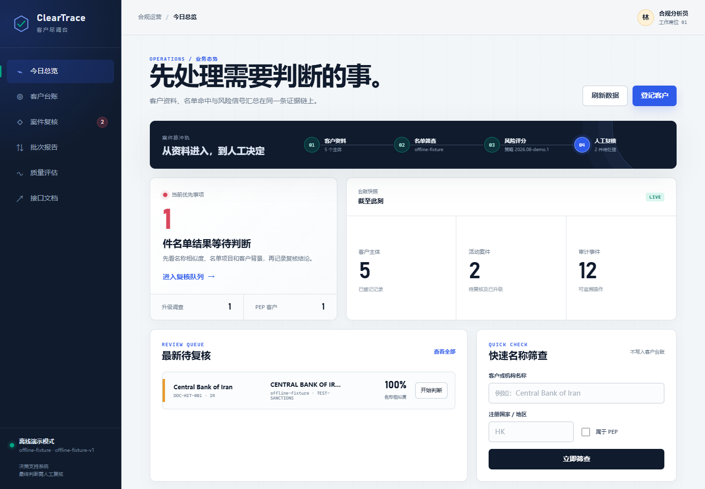
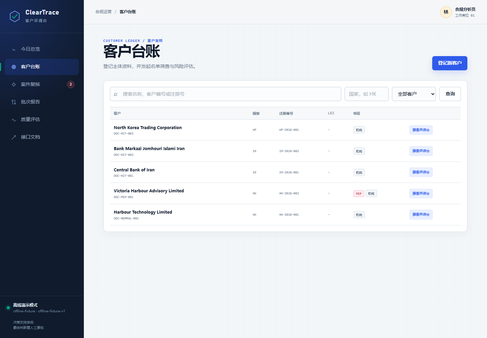
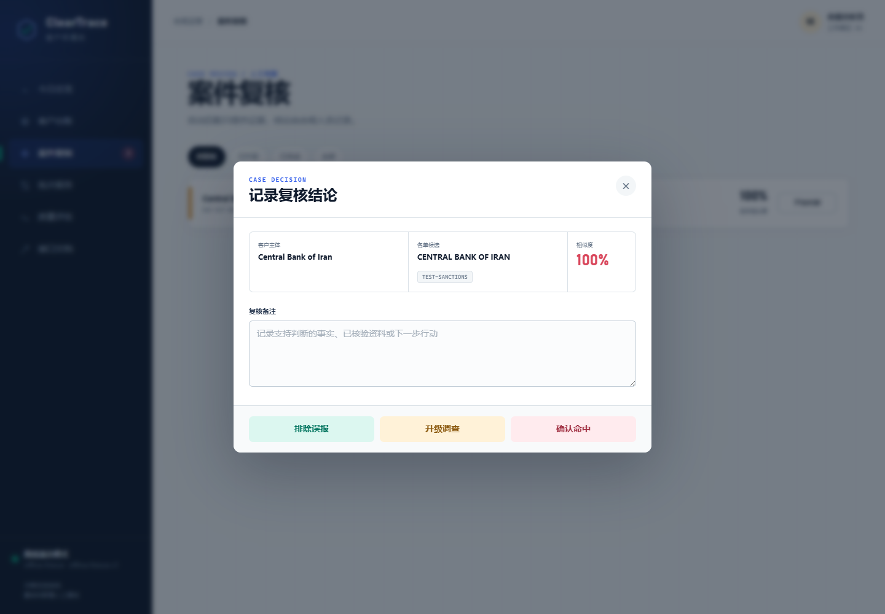
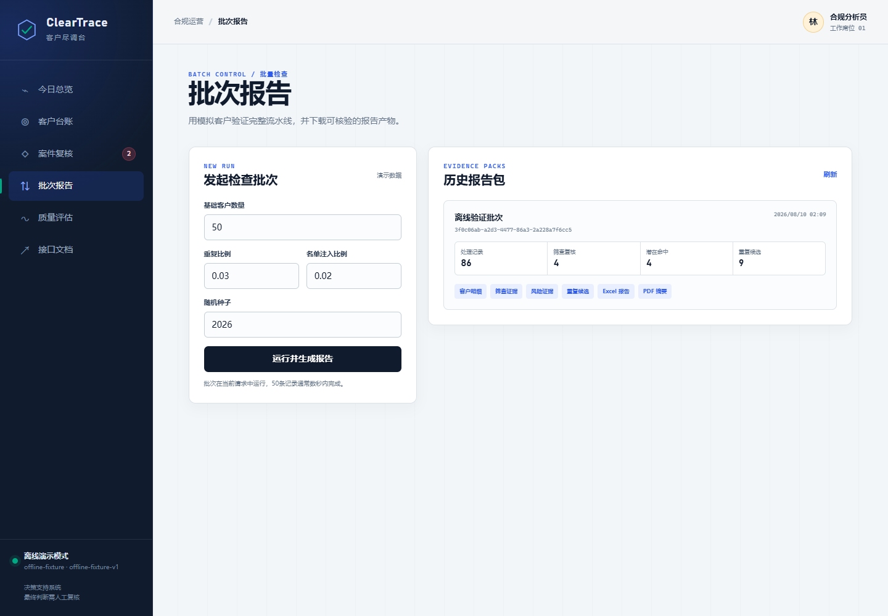
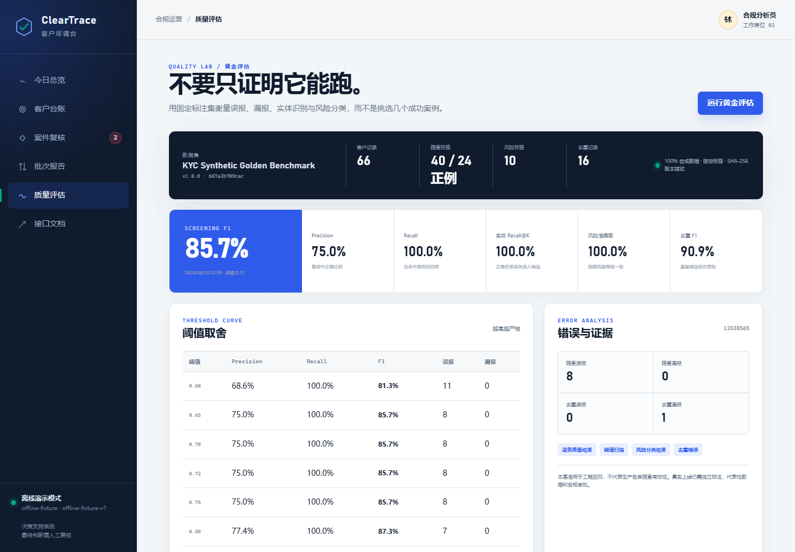
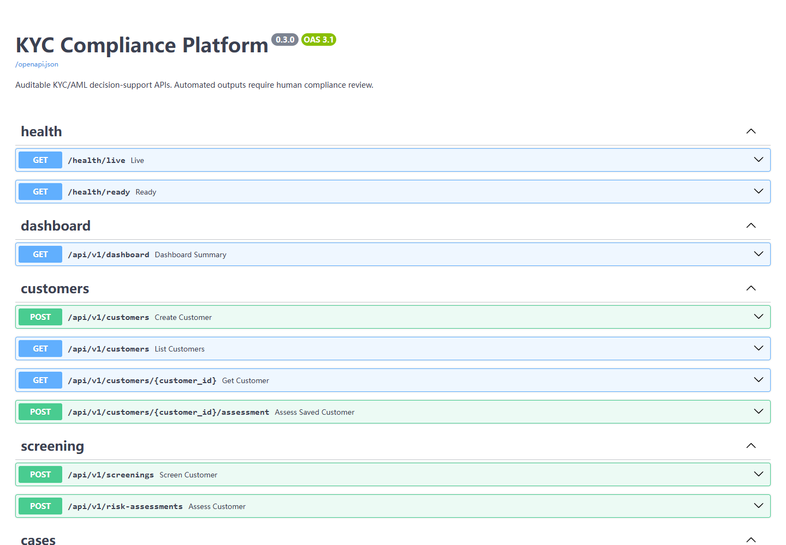
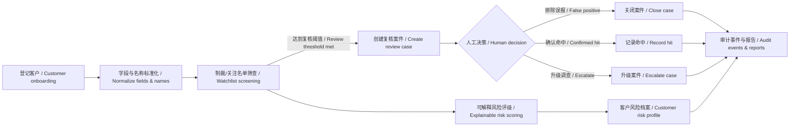

# KYC Compliance Platform | KYC 合规平台

面向香港 KYC/AML 场景的合规业务平台。项目把客户登记、名单筛查、风险评级、人工复核、批量报告、质量评估和审计留痕串成一条可运行、可测试、可演示的工作流。

A compliance workflow platform designed for Hong Kong KYC/AML scenarios. It connects customer onboarding, watchlist screening, risk scoring, human review, batch reporting, quality evaluation, and audit trails into a runnable, testable, and demonstrable workflow.

`Python 3.9+` · `FastAPI` · `SQLAlchemy` · `SQLite / PostgreSQL` · `23 tests passed` · `85% coverage` · `v0.3.0`

> 本项目是工程演示与决策支持工具，不构成法律意见，也不会自动作出制裁认定、可疑交易申报或开户决定。生产规则、数据源、阈值、留存政策和人工复核流程必须由适用机构的合规负责人批准并验证。
>
> This project is an engineering demonstration and decision-support tool. It does not constitute legal advice and does not automatically make sanctions determinations, suspicious transaction reporting decisions, or account-opening decisions. Production rules, data sources, thresholds, retention policies, and human-review procedures must be approved and validated by the relevant compliance function.

## 项目亮点 | Project Highlights

- 中文响应式业务工作台，面向一线业务人员和合规复核人员
- 客户保存后自动执行名称标准化、名单筛查和可解释风险评级
- 命中结果进入人工复核队列，支持排除误报、确认命中和升级调查
- 决策、备注和状态变化写入审计事件，保留可追溯证据
- 支持 CSV、JSONL、Excel、PDF 和运行清单等批处理产物
- 内置版本化黄金评估集，可比较筛查阈值并检查回归质量
- 同时提供 Web 后台、REST API、CLI、Docker Compose 和数据库迁移
- 离线演示固定使用合成数据，不依赖实时外部名单

- Responsive Chinese-language operations workspace for front-line users and compliance reviewers
- Automatic name normalization, watchlist screening, and explainable risk scoring after customer creation
- Screening candidates are routed to a human-review queue for false-positive dismissal, hit confirmation, or escalation
- Decisions, notes, and status changes are recorded as auditable events with traceable evidence
- Batch outputs include CSV, JSONL, Excel, PDF, and run manifests
- Versioned golden evaluation datasets support threshold comparison and regression-quality checks
- Web application, REST API, CLI, Docker Compose, and database migrations are all included
- Offline demonstrations use deterministic synthetic data and do not depend on live external watchlists

## 界面预览与业务流程 | Interface Preview & Business Workflow

以下截图由自动化浏览器在隔离数据库中生成，全部为合成演示数据，不包含真实客户信息。

The screenshots below are generated by an automated browser against an isolated database. All records are synthetic demonstration data and contain no real customer information.

### 1. 今日总览 | Dashboard

管理人员可以快速查看客户数量、活动案件、审计事件、待处理事项和案件状态分布，并直接进入高优先级复核。

Managers can quickly review customer counts, active cases, audit events, pending actions, and case-status distribution, then jump directly into high-priority reviews.



### 2. 客户台账 | Customer Registry

业务人员在这里登记、搜索和查看客户。系统展示注册号、注册地、LEI、PEP 标记、风险等级、筛查状态和更新时间。

Business users can register, search, and review customers. The system displays registration numbers, jurisdictions, LEIs, PEP flags, risk levels, screening status, and update timestamps.



### 3. 案件人工复核 | Human Case Review

名单候选不会被系统直接认定为命中。复核人员可以检查匹配分数、名单来源和证据，再选择“排除误报”“确认命中”或“升级调查”，同时记录理由。

Watchlist candidates are never automatically treated as confirmed hits. Reviewers can inspect matching scores, source lists, and evidence before dismissing a false positive, confirming a hit, or escalating the case, with reasons recorded for auditability.



### 4. 批次处理与报告 | Batch Processing & Reports

后台可以生成可重复的离线模拟批次，汇总总记录数、筛查复核、潜在命中和重复候选，并下载 Excel、PDF、CSV、JSONL 及审计清单。

The platform can generate repeatable offline simulation batches, summarize record counts, screening reviews, potential hits, and duplicate candidates, and export Excel, PDF, CSV, JSONL, and audit manifests.



### 5. 黄金集质量评估 | Golden Dataset Evaluation

质量页面使用固定标注集计算 Precision、Recall、F1、实体召回、风险分类准确率和去重指标，也提供阈值扫描与错误案例下载，便于发现模型或规则回归。

The quality workspace uses a fixed labeled dataset to calculate Precision, Recall, F1, entity retrieval, risk-classification accuracy, and deduplication metrics. It also supports threshold scans and error-case downloads for regression analysis.



### 6. OpenAPI 接口文档 | OpenAPI Documentation

FastAPI 自动生成交互式接口文档，覆盖健康检查、客户、筛查、案件、仪表盘、批次和评估等接口，方便联调与二次开发。

FastAPI automatically provides interactive API documentation covering health checks, customers, screenings, cases, dashboards, batches, and evaluations for integration and further development.



## 核心流程 | Core Workflow



## 快速开始 | Quick Start

### 方式一：使用项目已有的虚拟环境 | Option 1: Use the Existing Virtual Environment

在项目根目录打开 PowerShell：

Open PowerShell in the project root:

```powershell
.\.venv\Scripts\python.exe -m kyc_platform serve --reload
```

出现 `Uvicorn running on http://127.0.0.1:8000` 后，打开：

After `Uvicorn running on http://127.0.0.1:8000` appears, open:

- 业务后台 / Web workspace: <http://127.0.0.1:8000>
- OpenAPI: <http://127.0.0.1:8000/docs>
- 存活检查 / Liveness check: <http://127.0.0.1:8000/health/live>
- 就绪检查 / Readiness check: <http://127.0.0.1:8000/health/ready>

按 `Ctrl+C` 停止服务。

Press `Ctrl+C` to stop the service.

### 方式二：从零创建隔离环境 | Option 2: Create a Fresh Isolated Environment

```powershell
python -m venv .venv
.\.venv\Scripts\Activate.ps1
python -m pip install --upgrade pip
python -m pip install -r requirements-dev.txt
python -m kyc_platform serve --reload
```

如果 PowerShell 禁止激活脚本，可以一直使用 `.\.venv\Scripts\python.exe`，不会影响全局 Python 环境。

If PowerShell blocks activation scripts, you can continue using `.\.venv\Scripts\python.exe` directly without changing the global Python environment.

## 建议演示顺序 | Suggested Demo Flow

录制视频或向面试官演示时，可按下面的顺序进行：

For a recorded demo or interview walkthrough, the following sequence works well:

1. 打开“今日总览”，说明系统服务于业务人员和合规人员。  
   Open the Dashboard and explain that the platform supports both operations and compliance users.
2. 进入“客户台账”，新增一个普通客户，展示自动筛查与风险评级。  
   Open the Customer Registry, add a normal customer, and demonstrate automatic screening and risk scoring.
3. 新增名称为 `Central Bank of Iran` 的演示客户，触发离线名单候选。  
   Add a demonstration customer named `Central Bank of Iran` to trigger the deterministic offline watchlist fixture.
4. 进入“案件复核”，打开案件并演示人工决策与备注留痕。  
   Open Case Review and demonstrate a human decision with auditable notes.
5. 进入“批次报告”，运行模拟批次并展示可下载产物。  
   Run a simulated batch and show the downloadable reporting artifacts.
6. 进入“质量评估”，运行黄金集并讲解 F1、阈值扫描和错误案例。  
   Run the golden evaluation dataset and explain F1, threshold scans, and error cases.
7. 最后打开 `/docs`，说明后台之外还提供完整 REST API。  
   Finish with `/docs` to show that the platform also exposes a complete REST API.

> `Central Bank of Iran` 仅用于项目自带的确定性离线测试夹具。请勿把演示结果解释为实时或生产级制裁筛查结论。
>
> `Central Bank of Iran` is used only by the project's deterministic offline test fixture. Demonstration results must not be interpreted as real-time or production-grade sanctions-screening conclusions.

## 自动化测试与质量基线 | Automated Tests & Quality Baseline

运行全部检查：

Run all checks:

```powershell
.\.venv\Scripts\python.exe -m ruff format --check .
.\.venv\Scripts\python.exe -m ruff check .
.\.venv\Scripts\python.exe -m pytest
.\.venv\Scripts\python.exe -m pip check
```

本次文档更新时的自动化结果如下：

Automation results recorded for the current documentation baseline:

| 检查项 / Check | 结果 / Result |
| --- | ---: |
| 自动化测试 / Automated tests | 23 passed |
| 代码覆盖率 / Code coverage | 85% |
| Ruff 格式与静态检查 / Ruff formatting & linting | passed |
| Python 依赖一致性 / Python dependency consistency | passed |
| 业务后台浏览器控制台 / Browser console | 0 errors / 0 warnings |

### 黄金评估集 | Golden Evaluation Dataset

```powershell
.\.venv\Scripts\python.exe -m kyc_platform evaluate --dataset datasets\benchmark-v1
```

`datasets/benchmark-v1` 包含 66 条合成客户记录、40 个筛查标签（其中 24 个正例）、10 个风险标签和 16 条去重标注记录。当前默认基线为：

`datasets/benchmark-v1` contains 66 synthetic customer records, 40 screening labels including 24 positive cases, 10 risk labels, and 16 deduplication-labeled records. The current default baseline is:

| 任务 / Task | 指标 / Metric | 当前值 / Current Value |
| --- | --- | ---: |
| 名单筛查 / Watchlist screening | Precision | 0.7500 |
| 名单筛查 / Watchlist screening | Recall | 1.0000 |
| 名单筛查 / Watchlist screening | F1 | 0.8571 |
| 实体检索 / Entity retrieval | Recall@K | 1.0000 |
| 风险分类 / Risk classification | Accuracy | 1.0000 |
| 实体去重 / Entity deduplication | Precision | 1.0000 |
| 实体去重 / Entity deduplication | Recall | 0.8333 |
| 实体去重 / Entity deduplication | F1 | 0.9091 |

这些数值用于小型合成数据集上的工程回归，不代表真实生产名单筛查的有效性。

These metrics are engineering regression baselines on a small synthetic dataset and do not represent the effectiveness of real-world production watchlist screening.

## 命令行与 API | CLI & API

运行 100 条离线模拟记录：

Run 100 offline simulated records:

```powershell
.\.venv\Scripts\python.exe -m kyc_platform pipeline --records 100 --offline
```

每次运行会写入独立的 `outputs/<run-id>/`，不会因去重而删除原始记录。

Each run writes to an isolated `outputs/<run-id>/` directory. Deduplication produces candidates and does not delete source records.

直接调用筛查 API：

Call the screening API directly:

```powershell
Invoke-RestMethod -Method Post `
  -Uri http://127.0.0.1:8000/api/v1/screenings `
  -ContentType application/json `
  -Body '{"customer":{"record_id":"demo-1","legal_name":"Central Bank of Iran"}}'
```

## 技术架构 | Technical Architecture

| 层级 / Layer | 实现 / Implementation |
| --- | --- |
| 业务界面 / Web interface | 原生 HTML、CSS、JavaScript 中文工作台 / Native HTML, CSS, and JavaScript Chinese-language workspace |
| API | FastAPI、Pydantic、OpenAPI / FastAPI, Pydantic, OpenAPI |
| 业务服务 / Business services | 标准化、名单筛查、风险评估、实体解析、报告和评估服务 / Normalization, screening, risk, entity resolution, reporting, and evaluation services |
| 数据层 / Data layer | SQLAlchemy、Alembic、SQLite；可切换 PostgreSQL / SQLAlchemy, Alembic, SQLite; PostgreSQL supported |
| 工程质量 / Engineering quality | Pytest、Coverage、Ruff、GitHub Actions / Pytest, Coverage, Ruff, GitHub Actions |
| 部署 / Deployment | 本地虚拟环境或 Docker Compose / Local virtual environment or Docker Compose |

项目坚持几个关键边界：外部名单通过连接器与业务逻辑解耦；风险策略使用版本化 JSON；所有人工决定留下审计事件；去重只产生候选，不自动删除或合并源记录。

The project enforces several important boundaries: external watchlists are decoupled from business logic through connectors; risk policies are versioned in JSON; every human decision creates an audit event; and deduplication produces candidates without automatically deleting or merging source records.

## 项目结构 | Project Structure

```text
src/kyc_platform/
  api/               FastAPI 路由与请求/响应模型 / routes and request-response models
  domain/            与框架无关的领域对象 / framework-independent domain objects
  infrastructure/    SQLAlchemy、仓储和外部基础设施 / SQLAlchemy, repositories, external infrastructure
  services/          标准化、筛查、风险、实体解析、流水线和报告 / normalization, screening, risk, entity resolution, pipeline, reporting
  web/               中文业务工作台 HTML、CSS 和 JavaScript / Chinese-language web workspace
config/              版本化风险策略 / versioned risk policies
datasets/            合成黄金评估集与人工预期标签 / synthetic golden datasets and expected labels
migrations/          Alembic 数据库迁移 / Alembic database migrations
tests/               单元测试与集成测试 / unit and integration tests
docs/screenshots/    README 使用的自动化页面截图 / automated screenshots used by the README
docs/                架构、开发和产品路线文档 / architecture, development, and roadmap documentation
```

进一步阅读 / Further reading:

- [架构说明 / Architecture](docs/ARCHITECTURE.md)
- [开发指南 / Development Guide](docs/DEVELOPMENT.md)
- [大型化路线图 / Project Roadmap](docs/PROJECT_ROADMAP.md)

## Docker Compose

```powershell
docker compose up --build
```

该方式会启动 PostgreSQL 和 API。Compose 中的开发密码仅供本地使用，生产环境必须改用密钥管理，并补充身份认证、权限控制、生产名单源、监控告警和正式数据治理流程。

This starts PostgreSQL and the API. Development credentials in the Compose configuration are for local use only. Production deployments require proper secrets management, authentication, authorization, approved watchlist sources, monitoring and alerting, and formal data-governance controls.

## 当前定位 | Current Positioning

当前版本适合作为可运行的 KYC/AML 工程作品、内部原型和面试演示项目。它已经覆盖完整业务闭环和质量评估，但在真实生产部署前仍需接入经过授权的名单数据、统一身份认证、角色权限、加密与密钥管理、法务审批、监控告警以及机构级验证。

The current version is suitable as a runnable KYC/AML engineering portfolio project, internal prototype, and interview demonstration. It covers an end-to-end business workflow and quality evaluation, but real production deployment would still require authorized watchlist data, centralized authentication, role-based access control, encryption and secrets management, legal/compliance approval, monitoring and alerting, and institution-level validation.
