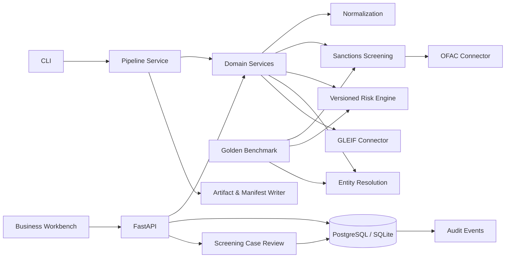

# Architecture

## 设计原则

1. **决策支持而非自动裁决**：匹配、风险和实体解析都输出证据与建议，最终决定属于授权人员。
2. **不可丢失源数据**：去重产生候选关系，不直接删除、覆盖或不可逆合并客户记录。
3. **每次运行可回放**：产物记录数据源、风险策略、配置、时间和 SHA-256。
4. **外部数据可替换**：OFAC、GLEIF 和未来 PEP/负面新闻来源通过连接器隔离。
5. **先模块化单体**：领域边界稳定后，再按独立扩缩、故障隔离和团队所有权拆服务。

## 组件关系

## 信任边界

- 客户数据、证件和调查记录是敏感数据；当前仓库只使用合成数据。
- 外部名单必须保存获取时间、原始快照和内容 hash；解析失败不得静默降级为“无命中”。
- API 目前只有 `X-Actor-ID` 审计占位符，不是认证。生产部署前必须接入 OIDC、RBAC、租户隔离、
  传输/静态加密、秘密管理、下载控制和不可篡改审计存储。
- `create_all` 仅方便开发；生产数据库结构变更必须通过 Alembic migration。

## 当前业务工作台边界

- 工作台直接由 FastAPI 提供，无额外 Node.js 运行时；页面通过版本化 REST API 读写。
- 保存客户后可执行筛查与风险评估，达到复核阈值的候选会持久化为 Screening Case。
- 复核支持误报排除、确认命中和升级调查；操作者、备注及时间写入案件证据和审计事件。
- 批次报告仍是同步任务，适合本地演示和小批量验证，不适合生产大批量调度。
- 黄金评估固定输入、标签、风险评估日期和数据集指纹，输出逐条结果及阈值扫描；它用于工程回归，
  不替代独立的生产模型验证。

## 下一步边界

- `case-management`：分派、四眼覆核、SLA、评论、附件、决定历史、重开和申诉。
- `party-graph`：自然人、法人、信托、董事、授权人、股东和 UBO 控制链。
- `ongoing-monitoring`：客户事件、名单更新、交易监控和批量重筛。
- `worker`：将 API 中的批处理迁移到 Celery/RQ 等持久化任务队列。
